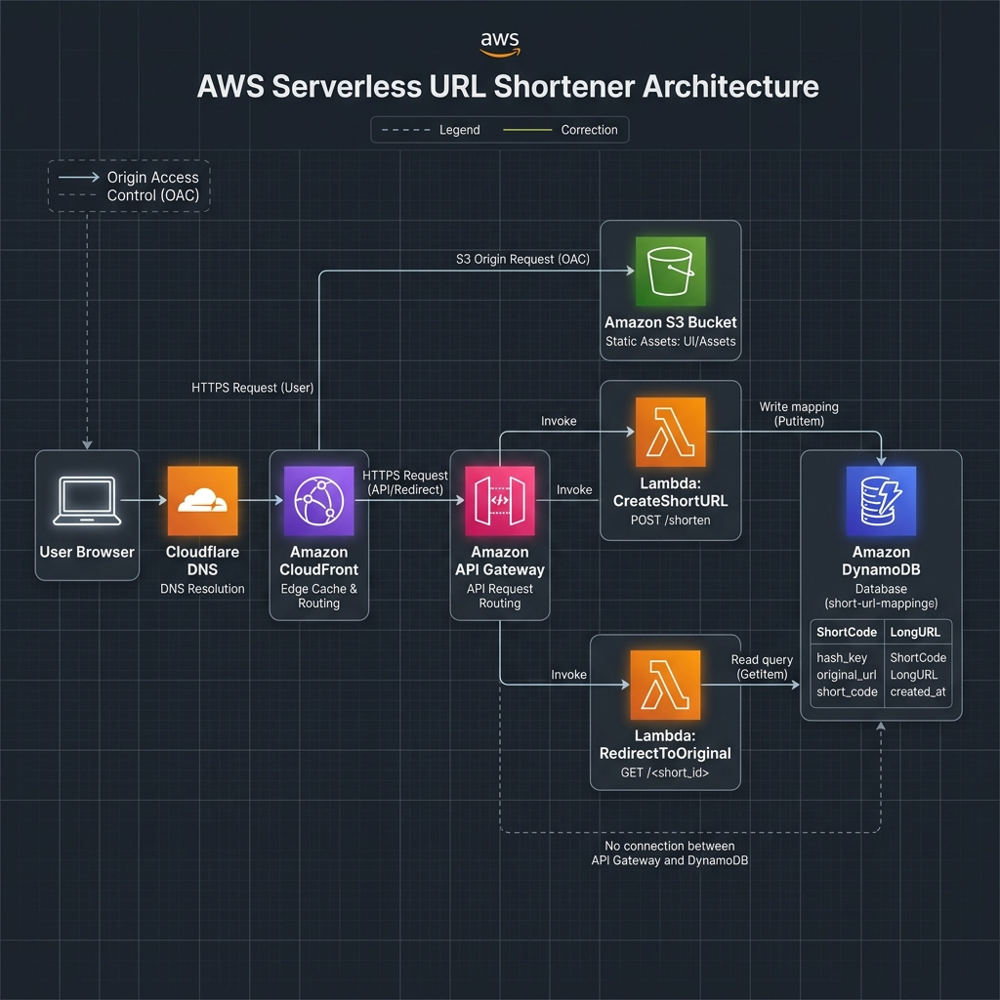

# Serverless URL Shortener & Redirect Engine
An enterprise-grade, high-performance, cost-effective serverless URL shortening application built on AWS and globally accelerated via CloudFront and Cloudflare.

---

## 🏗️ Architecture Design



### ⚡ Technical Execution Flow
1. **DNS Resolution**: The user requests a page or short URL via `snip.yourdomain.com`. Cloudflare resolves this to the Amazon CloudFront distribution CNAME (`d1xxxxxxxxxxxx.cloudfront.net`).
2. **Global Acceleration**: CloudFront terminates the SSL (using a certificate generated in AWS Certificate Manager) and inspects the URL path.
3. **Smart Path Routing**:
   * **Static Assets**: Requests for `/index.html`, `/assets/*` or `favicon.svg` are securely routed via **Origin Access Control (OAC)** to a private S3 bucket (`sniplink-frontend`).
   * **Write Action**: `POST /shorten` requests are routed directly to the Amazon API Gateway HTTP API.
   * **Read Action (Fallback)**: Any dynamic shortcode route `/abc123` is intercepted by the catch-all CloudFront behavior and sent to API Gateway.
4. **Serverless Execution**:
   * **Create**: `CreateShortURL` generates a random base64url 6-character hash, stores the mapping (`shortcode` ➔ `originalUrl`) in Amazon DynamoDB, and returns the shortlink.
   * **Redirect**: `RedirectToOriginal` performs a DynamoDB query and returns a `301 Moved Permanently` header with the target destination, redirecting the client browser in milliseconds.

---

## 💰 Operational Economics
Since the entire stack is 100% serverless, it inherits **scale-to-zero** economics.

| Component | AWS Resource | Free Tier Coverage | Monthly Cost (100,000 requests/mo) |
| :--- | :--- | :--- | :--- |
| **Frontend** | CloudFront + S3 | 1 TB data transfer / 100M requests | $0.00 |
| **Compute** | AWS Lambda | 1 Million free requests / month | $0.00 |
| **Database** | DynamoDB | 25 GB free storage | $0.00 |
| **Routing** | API Gateway (HTTP) | N/A (Highly optimized pricing) | ~$0.10 |
| **Security** | AWS Certificate Manager | Unlimited SSL certificates | $0.00 |
| **Total Cost** | | | **~$0.10 / month** |

---

## 🛠️ Deployment Configuration

### Frontend Deployment
The React frontend is compiled to clean HTML/CSS/JS and synchronized to S3. To prevent caching issues with modern deployments, the `index.html` file is explicitly uploaded with a `max-age=0` cache header.

```bash
# 1. Compile production assets
npm run build

# 2. Sync files to S3 (excluding index.html to cache CSS/JS files indefinitely)
aws s3 sync dist/ s3://sniplink-frontend/ --delete

# 3. Force upload index.html without cache headers
aws s3 cp dist/index.html s3://sniplink-frontend/index.html \
  --content-type "text/html" \
  --cache-control "no-store, no-cache, must-revalidate, max-age=0"
```

### Infrastructure as Code (IaC)
The backend database, API endpoints, and Lambda IAM roles are fully defined in the CloudFormation template:
* 📄 [datacenter-priority-stack.yml](file:///c:/Users/USER/OneDrive/Documents/url-shortner/datacenter-priority-stack.yml)
