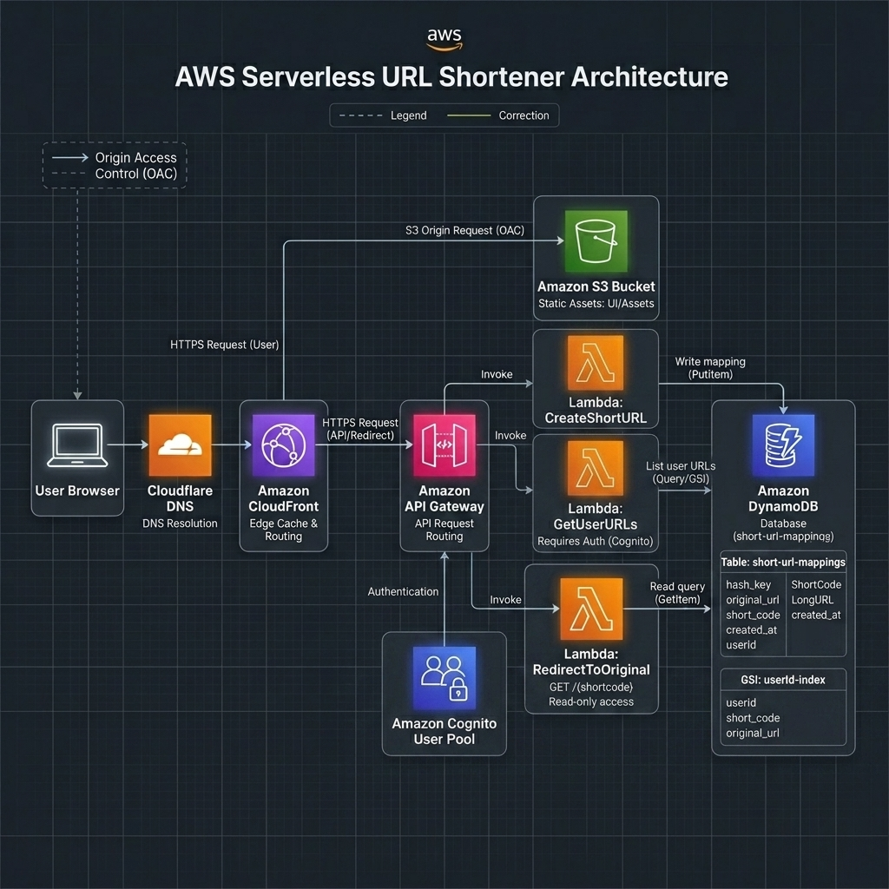

# ⚡ Sniplink — Serverless URL Shortener

A production-grade, serverless URL shortening platform built entirely on AWS. Sniplink delivers instant redirects, user authentication, and a personal link dashboard — all for under $0.25/month at scale.

**🌐 Live:** [snip.rsarkhel.com](https://snip.rsarkhel.com)

---

## 🏗️ Architecture



### Request Flow

1. **DNS Resolution** — User requests `snip.rsarkhel.com`. Cloudflare resolves the CNAME to the CloudFront distribution.
2. **Edge Routing** — CloudFront terminates SSL (ACM certificate) and inspects the URL path:
   - `/index.html`, `/assets/*`, `/favicon.svg` → **S3 Bucket** (via Origin Access Control)
   - `POST /shorten`, `GET /my-urls` → **API Gateway HTTP API** (JWT-protected)
   - `GET /{shortcode}` → **API Gateway HTTP API** (public)
3. **Serverless Compute** — API Gateway invokes the appropriate Lambda function:
   - **CreateShortURL** — Generates a 6-character `base64url` shortcode, stores the mapping in DynamoDB, and returns the short link.
   - **GetUserURLs** — Queries a DynamoDB GSI (`userId-index`) to return all links created by the authenticated user.
   - **RedirectToOriginal** — Performs a DynamoDB `GetItem` lookup and returns a `301 Moved Permanently` redirect.
4. **Authentication** — Amazon Cognito User Pool issues JWTs. The API Gateway JWT Authorizer validates tokens on protected routes — no auth logic in Lambda.

---

## 🛠️ Tech Stack

| Layer | Technology |
|:---|:---|
| **Frontend** | React 19, Vite 8, AWS Amplify UI |
| **Authentication** | Amazon Cognito (User Pool + JWT Authorizer) |
| **API** | Amazon API Gateway (HTTP API) |
| **Compute** | AWS Lambda (Node.js 24.x) |
| **Database** | Amazon DynamoDB (On-Demand, GSI for user queries) |
| **CDN / Routing** | Amazon CloudFront + Cloudflare DNS |
| **Storage** | Amazon S3 (private bucket, OAC) |
| **SSL** | AWS Certificate Manager |
| **CI/CD** | GitHub Actions |
| **IaC** | AWS CloudFormation |

---

## ✨ Features

- **Instant Redirects** — Sub-50ms DynamoDB lookups with 301 redirects globally cached at CloudFront edge locations.
- **User Authentication** — Sign up, sign in, and email verification powered by Cognito. No passwords stored in the app.
- **Personal Dashboard** — View all your shortened links in one place with creation dates.
- **Password Management** — Change your password securely from the profile tab.
- **Auto URL Correction** — Automatically prepends `https://` if the protocol is missing.
- **One-Click Copy** — Copy shortened URLs to clipboard instantly.
- **Responsive Dark UI** — Glassmorphism design with animated backgrounds, optimized for all screen sizes.

---

### Backend (AWS Lambda — managed in Console)

| Function | Route | Auth | Description |
|:---|:---|:---|:---|
| `CreateShortURL` | `POST /shorten` | JWT | Generates shortcode, stores mapping in DynamoDB |
| `GetUserURLs` | `GET /my-urls` | JWT | Queries user's links via `userId-index` GSI |
| `RedirectToOriginal` | `GET /{shortcode}` | None | Looks up shortcode, returns 301 redirect |

---

## 🚀 Deployment

### CI/CD Pipeline

Every push to `main` triggers the GitHub Actions workflow:

1. **Checkout** → **Install dependencies** (`npm ci`)
2. **Inject environment variables** from GitHub Secrets into `.env`
3. **Build** production assets (`npm run build`)
4. **Deploy** to S3 (`aws s3 sync dist/ s3://sniplink-frontend/ --delete`)
5. **Invalidate** CloudFront cache (`/*`)

---

## 💻 Local Development

### Prerequisites

- Node.js 20+
- An AWS account with the backend resources deployed

### Setup

```bash
# Clone the repository
git clone https://github.com/sarkhelranit/sniplink.git
cd sniplink

# Install dependencies
npm install

# Edit .env with your Cognito and API Gateway values

# Start dev server
npm run dev
```

The app will be available at `http://localhost:5173`.

### Environment Variables

| Variable | Description |
|:---|:---|
| `VITE_API_URL` | API Gateway base URL (e.g., `https://xxxxxxxxxx.execute-api.us-east-1.amazonaws.com`) |
| `VITE_COGNITO_USER_POOL_ID` | Cognito User Pool ID (e.g., `us-east-1_xxxxxxxxx`) |
| `VITE_COGNITO_CLIENT_ID` | Cognito App Client ID (SPA type, no client secret) |

---

## 💰 Cost Analysis

The entire stack is 100% serverless — **scale-to-zero economics** with no idle costs.

| Component | AWS Resource | Free Tier | Monthly Cost (100K requests) |
|:---|:---|:---|:---|
| **Frontend** | CloudFront + S3 | 1 TB transfer / 10M requests | $0.00 |
| **Auth** | Cognito | 10,000 MAU free | $0.00 |
| **Compute** | Lambda | 1M requests / 400K GB-s | $0.00 |
| **Database** | DynamoDB (On-Demand) | 25 GB storage | ~$0.07 |
| **API** | API Gateway (HTTP) | 1M requests free (12 months) | ~$0.10 |
| **SSL** | ACM | Unlimited certificates | $0.00 |
| | | | **~$0.17/month** |

---

## 📄 License

This project is open source and available under the [MIT License](LICENSE).

---

<p align="center">
  Built with ☁️ on AWS Serverless by <a href="https://rsarkhel.com">Ranit Sarkhel</a>
</p>
